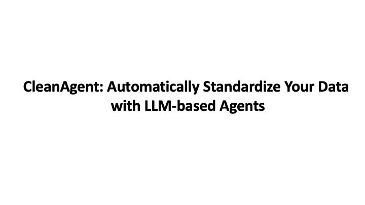

# CleanAgent: Automatically Standardize Your Data with LLM-based Agents
### Introduction
**`CleanAgent`** is a tool that automates the data standardization process with LLM-based Agents. You only need to upload the table that needs to be standardized, and **`CleanAgent`** will get your hands free, standardize your data automatically and return the standardized table to you.
Our demo paper **CleanAgent: Automating Data Standardization with LLM-based Agents** will be published in the future.

If you think this small project is interesting or helpful to you, please considering give us a star:star2::star2::star2:! :smiley:

### Usage
Please use **`CleanAgent`** with the following commands:
```shell
git clone https://github.com/sfu-db/CleanAgent
cd CleanAgent
conda create -n cleanagent python=3.10.6
conda activate
export OPENAI_API_KEY="Your_Openai_API_Key"
pip install -r requirements.txt
chainlit run main.py
```
Then you can see the web UI of **`CleanAgent`** on `http://localhost:8000`

### Demonstration
You also can watch the following 4-mins demo to learn how to use **`CleanAgent`**:

<a href="https://youtu.be/fSYXVM6qeqM"></a>

### Citation
If you think **`CleanAgent`** is useful for you, please considering to cite our **`CleanAgent`**:
```bibtex
@inproceedings{cleanagent2024,
  author    = {Danrui Qi and Jiannan Wang},
  title     = {CleanAgent: Automating Data Standardization with LLM-based Agents},
  booktitle = {XX},
  year      = {2024}
}
```
